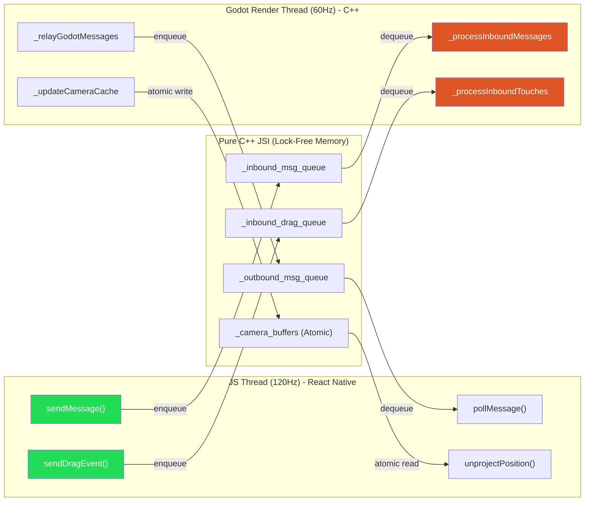

# 👾 react-native-nitro-godot: Architecture & Context

**The Enterprise Gold Standard for Zero-Overhead Godot 4 & React Native Integration.**

This document details the core philosophy, technical architecture, and low-level operating system hacks required to seamlessly embed a AAA C++ game engine (Godot 4.x) inside a modern React Native application while achieving **100% thread isolation and zero UI latency**.

---

## 1. The Core Philosophy: "Inversion of Control"

Traditional hybrid engine integrations attempt a "Full API Binding" approach—exposing the engine's entire 3D API to JavaScript. This forces the engine to evaluate JavaScript contexts, resulting in massive serialization overhead, locked threads, React Reconciler choking, and severe battery drain.

`react-native-nitro-godot` rejects this approach. It is built on three pillars:

1. **Godot is a Black Box "Game Server":** All 3D rendering, physics, and game logic run purely in compiled C++/GDScript on a dedicated background thread.
2. **React Native is a "Dumb Client":** All UI, HUDs, menus, and OS interactions run at 120Hz on the Main JS Thread.
3. **Zero Vendor Lock-in:** By using the official Godot C-API and standard linker configurations, developers compile vanilla Godot. No custom engine forks are required.

---

## 2. The 100% Lock-Free Bridge (Concurrency Architecture)

To prevent the 120Hz JS UI thread from blocking while waiting for the 60Hz Godot render thread, all cross-boundary communication routes through **Single-Producer / Single-Consumer (SPSC) Lock-Free Queues** (`moodycamel`).

### Unidirectional Data Flow

**Thread Safety Guarantees:**

- **JS Thread:** ZERO Godot API calls. ZERO mutex locks. It only writes to or reads from C++ memory.
- **Godot Thread:** ZERO React Native blocking. It drains inputs at the start of its frame, processes physics, and pushes state out at the end of its frame via `register_main_loop_callbacks`.

---

## 3. The 5 Architectural Epics

### I. Hardware-Level Input Spoofing

React Native touch events are natively captured, scaled by device `PixelRatio`, and pushed to the C++ inbound SPSC queue as lightweight structs. On the Godot thread, C++ dynamically instantiates Godot's internal `InputEventScreenTouch` and `InputEventScreenDrag` objects and injects them directly into Godot's OS input parser. Standard Godot UI, `Area3D` clicks, and physics raycasts work perfectly without custom JS routing.

### II. CQRS State Sync (Zero-Render HUD)

If Godot spammed the JS thread with player health updates at 60Hz, standard state managers (Zustand/Redux) would choke the React Reconciler.
**The Fix:** Godot acts as an Authoritative Local Server. It pushes game state updates to the outbound SPSC queue. JS ingests these into **Legend-State v3 fine-grained observables**. Using `<Reactive.Text>`, native iOS/Android views update instantly at 60FPS with **zero React component re-renders**.

### III. Zero-Latency 3D-to-2D Projection (Reanimated)

To draw 2D React Native UI (like floating health bars) over moving 3D Godot enemies, crossing an asynchronous bridge takes ~16ms, causing the UI to visually lag ("swim").
**The Fix:** Godot atomically writes its `Camera3D` View/Projection matrices to a C++ double-buffer every frame. Reanimated's UI-thread worklets call `engine.unprojectPosition(x,y,z)` synchronously, which performs pure C++ MVP matrix math instantly. **Zero React bridge crossings, zero visual latency.**

### IV. Asynchronous Bootstrap Pattern

Calling `libgodot_create_godot_instance()` synchronously with a massive `.pck` file freezes the React Native JS thread and the OS UI.
**The Fix:** The engine initializes with a microscopic (<1MB) `bootstrap.pck` in under 50ms. React Native then calls `loadSceneAsync()`, prompting Godot's background worker threads to load heavy 3D assets while streaming `LOAD_PROGRESS` payloads back to a buttery-smooth React Native `<ProgressBar />`.

### V. Zero-Copy Data Pipelines (AI/ML Ready)

Leveraging Nitro Modules, we create Native-Owned `ArrayBuffer` instances. Large tensor outputs from on-device ML models (or dynamically generated textures) in React Native are passed to C++. The Godot render thread reads the raw `uint8_t* pointer` instantly, passing it to Vulkan/Metal shaders with **absolute zero-copy serialization overhead**.

---

## 4. OS-Level Surgery (The Hostile Takeover)

Game engines natively assume they dictate the OS. They expect to own the App Lifecycle, the Main UI Thread, and the hardware surfaces. To embed Godot smoothly, this architecture performs extreme low-level "Inversion of Control" hacks.

### 🍏 iOS: The Linker Lobotomy

Godot's default iOS driver (`godot_view_renderer.mm`) hardwires itself to Apple's `CADisplayLink` (hardware VSync), forcing Godot to render on the iOS Main UI Thread. This collides fatally with React Native's layout engine, causing a `Main Thread Checker` crash.

- **The Hack:** Using a CocoaPods `script_phase`, the build process cracks open the static `libgodot.a` binary and surgically deletes the `godot_view_renderer.o` object file at link-time.
- **The Result:** Godot's automatic UIKit hooks are lobotomized. The C++ bridge steals React Native's `CAMetalLayer` pointer, hands it to Godot, and drives the engine manually from a custom C++ `std::thread`.

### 🤖 Android: The JNI / JVM Bypass

Godot's Android architecture expects to run behind a Java `GodotActivity` and requests the `.pck` via Android's Java `AAssetManager`. Without this, embedded C++ Godot segfaults instantly.

- **The Hack:** Because RN owns the Java Activity, the C++ C-API initializes with completely null JNI pointers. The C++ layer was heavily patched to handle null JVM contexts, force `ACCESS_FILESYSTEM` to degrade to Unix file I/O, and manually inject React Native's `ANativeWindow` pointer directly into the Vulkan DisplayServer.
- **The Vulkan Guard:** Android ruthlessly destroys `ANativeWindow` surfaces when the app backgrounds. An atomic `is_surface_attached_` guard was implemented in the C++ render loop. When the app backgrounds, we instantly detach the surface and flush all inbound SPSC queues (preventing "ghost touches"). Godot idles safely in memory until the app resumes and the `ANativeWindow` is hot-swapped.

---

## 5. DevOps & Robustness

- **Strict Patching Pipeline:** Instead of fragile `sed` commands, Godot engine modifications are maintained as version-pinned Git `.patch` files, ensuring clean upgrades and highly reviewable OS-level hacks.
- **Cross-Thread Error Boundary:** Fatal Godot boot errors (e.g., missing Vulkan instances, dead JNI pointers) are caught in C++, serialized into JSON `ENGINE_ERROR` payloads, and pushed across the SPSC queue to React Native, preventing "Silent Black Screens of Death" and providing a premium Developer Experience.

---

## 6. Architecture Comparison: `borndotcom` vs. `nitro-godot`

While the impressive `borndotcom/react-native-godot` project exists, it serves a fundamentally different use case.

| Feature            | `borndotcom` (Full API Binding)                     | `nitro-godot` (Our Architecture)          |
| :----------------- | :-------------------------------------------------- | :---------------------------------------- |
| **Philosophy**     | Expose entire Godot ClassDB to JS.                  | Godot as a decoupled Black Box server.    |
| **Threading**      | JS Worklets execute on the Godot C++ thread.        | 100% Thread Isolated via SPSC Queues.     |
| **UI Updates**     | Standard React state (`useState`) / JS Callbacks.   | Zero-render bindings via Legend-State v3. |
| **Use Case**       | 3D Menus, Web-dev friendly scripting, simple games. | AAA, 60FPS physics-heavy mobile games.    |
| **Vendor Lock-in** | Requires custom Migeran `LibGodot` binaries.        | Vanilla Godot source compiled locally.    |

---

## 7. Why Use This Over Pure Godot? (The Business Value)

If building a standard, full-screen console game, pure Godot is sufficient. However, modern mobile games (and "gamified" consumer apps) are fundamentally massive applications with a 3D view in the center.

`react-native-nitro-godot` offers massive competitive advantages for modern studios:

1. **The "Meta-Game" Superiority:** Players spend 70% of their time in menus, stores, and lobbies. Godot's UI nodes are notoriously rigid. React Native provides Flexbox, Web CSS paradigms, and deep accessibility features, allowing developers to build complex, scrollable, native-feeling UIs in a fraction of the time.
2. **The Plugin Ecosystem:** Integrating Apple Sign-In, IAP, Stripe, AdMob, or Firebase into Godot requires writing custom Java/Objective-C++ wrappers. In React Native, it is a simple `npm install`.
3. **Asymmetric Performance & Battery:** Because of the lock-free architecture, a massive 3D explosion can drop the Godot physics engine to 30 FPS, but the React Native UI will remain perfectly responsive at 120 FPS. Furthermore, the Godot C++ thread can be entirely paused (`suspendOS()`) when a user opens a 2D menu, dropping battery consumption to near-zero.
4. **Over-The-Air (OTA) Updates:** Because the UI and meta-game are written in JS, studios can use Expo Updates / CodePush to instantly fix bugs, change monetization layouts, or drop new content without waiting for Apple/Google App Store review.
5. **Team Scaling:** A studio can safely hire standard, affordable Web/React developers to build 80% of the game (Auth, UI, Social), while specialized Technical Artists and C++ devs work strictly inside the isolated Godot "Black Box." They never step on each other's toes.

## 8. Known Limitations & Tracked Follow-ups

These are deliberately-scoped items that require on-device compilation and iteration to land safely. They are documented here (rather than half-implemented) so the constraints are explicit.

### 8.1 Render-loop resumption after `destroy()` + remount

The Godot instance is a process-wide singleton that is intentionally never destroyed (`Main::cleanup()` cannot fully reset Godot's global state). The render thread, however, is owned per-`HybridGodotEngine` object and is joined on `destroy()`. After a remount (e.g. Expo Fast Refresh), `start()` takes the reuse branch — which now re-points `g_engine` and re-adopts the live GDExtension state, but does **not** re-spawn the render thread, because Godot's `RenderingServer` has thread affinity to the original render thread. Driving `iteration()` from a freshly spawned thread is unsafe.

**Proper fix:** promote the render loop to a single, process-global thread that survives `destroy()` and is paused/resumed rather than joined. The JS `useGodotEngine` cleanup should then `pause()` on transient unmount instead of `destroy()`.

### 8.2 `suspendOS()` / `resumeOS()` thread affinity

These run on the JS thread and call `variant_call` into `SceneTree`/`RenderingServer`/`AudioServer` directly, which can race the render thread's `iteration()`. They cannot simply defer the work to the frame callback, because suspend *pauses* the loop (so the callback would never run). A correct fix needs a dedicated lifecycle-command channel drained at a safe point in the render thread before it parks.

### 8.3 Single ABI / architecture coverage

The engine is built for `arm64-v8a` (Android) and `ios-arm64` + `ios-arm64-simulator` only. There is no `x86_64` Android emulator slice. `android/CMakeLists.txt` now selects the slice via `${ANDROID_ABI}`, so shipping more ABIs is just a matter of building the engine for them (`engine_build/build_godot.sh`).

### 8.4 `GodotView` uses the legacy (Paper) component API

`src/GodotView.tsx` uses `requireNativeComponent`, which relies on the new-architecture interop layer. A native Fabric component (or Nitro view) would be the consistent long-term choice; deferred because it is a native rewrite that must be validated on-device.

## Conclusion

`react-native-nitro-godot` fundamentally tricks a massive, standalone, dictator C++ game engine into operating as a docile, headless, ultra-high-performance background microservice. It is the definitive solution for next-generation hybrid mobile applications.
